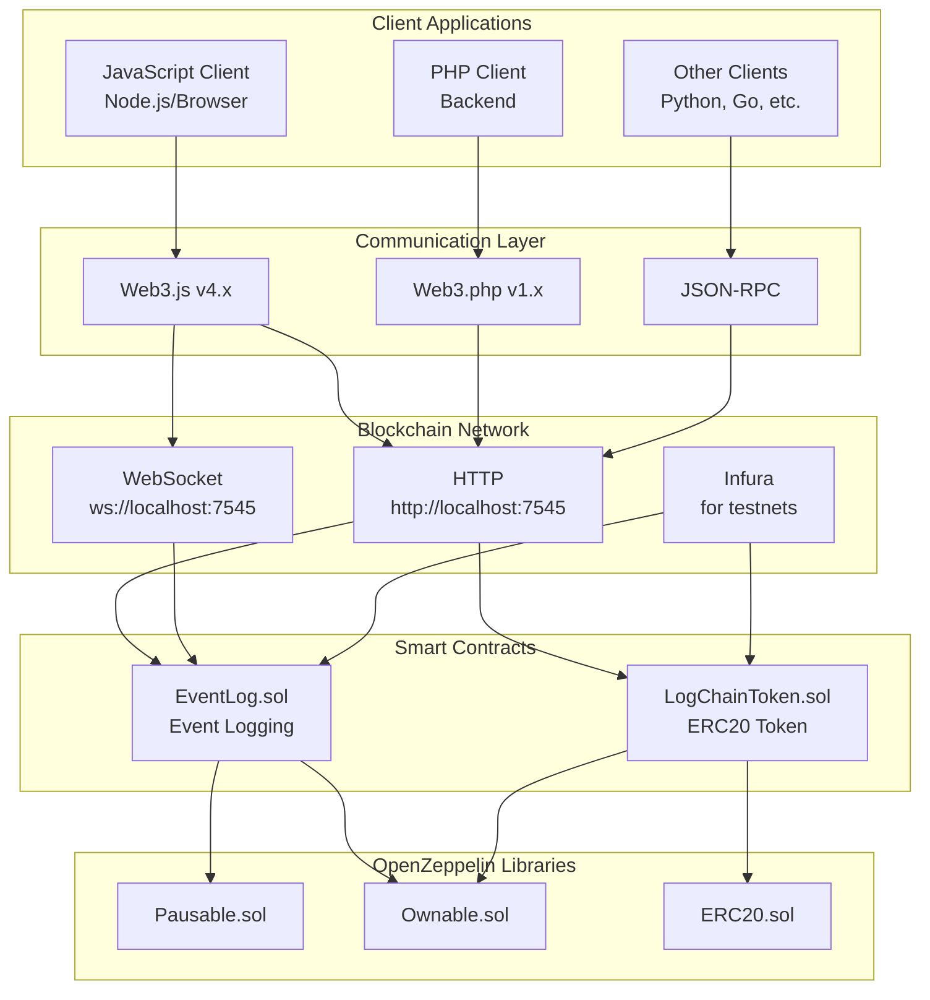
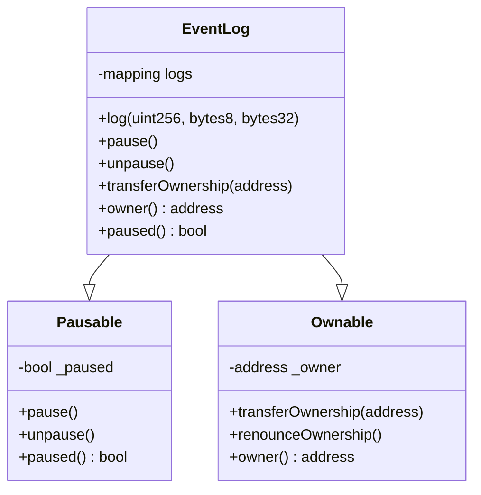
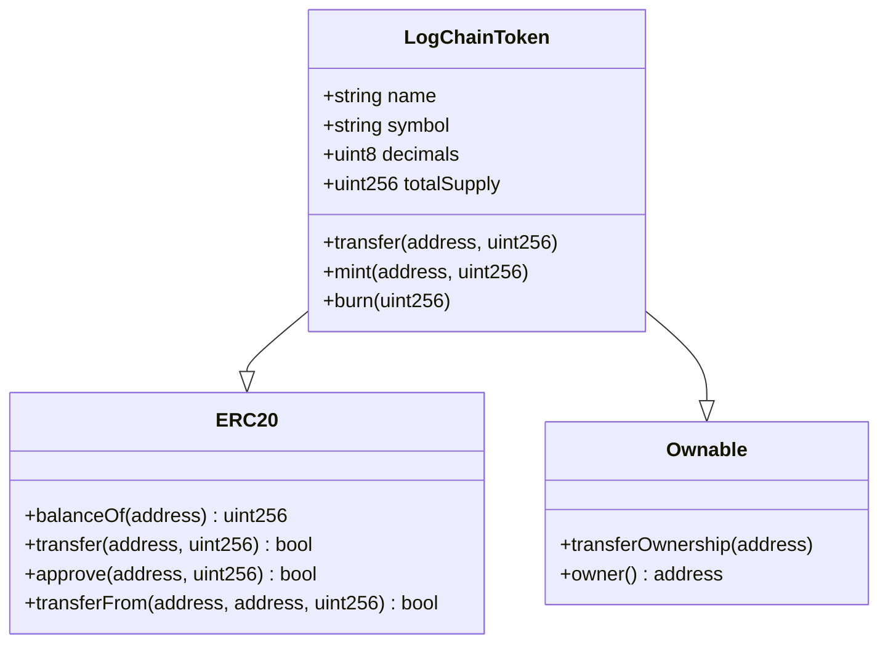
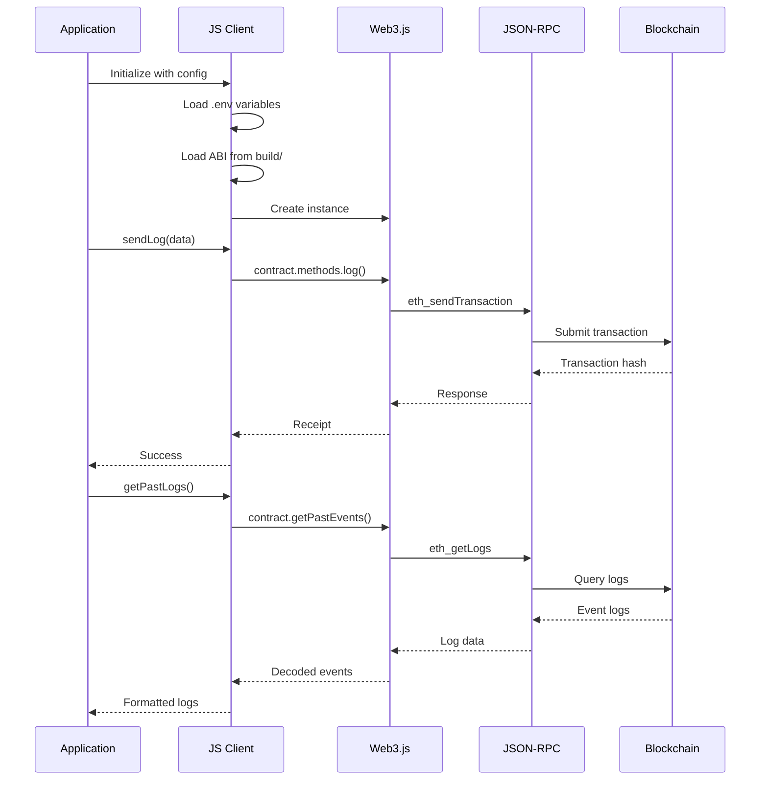
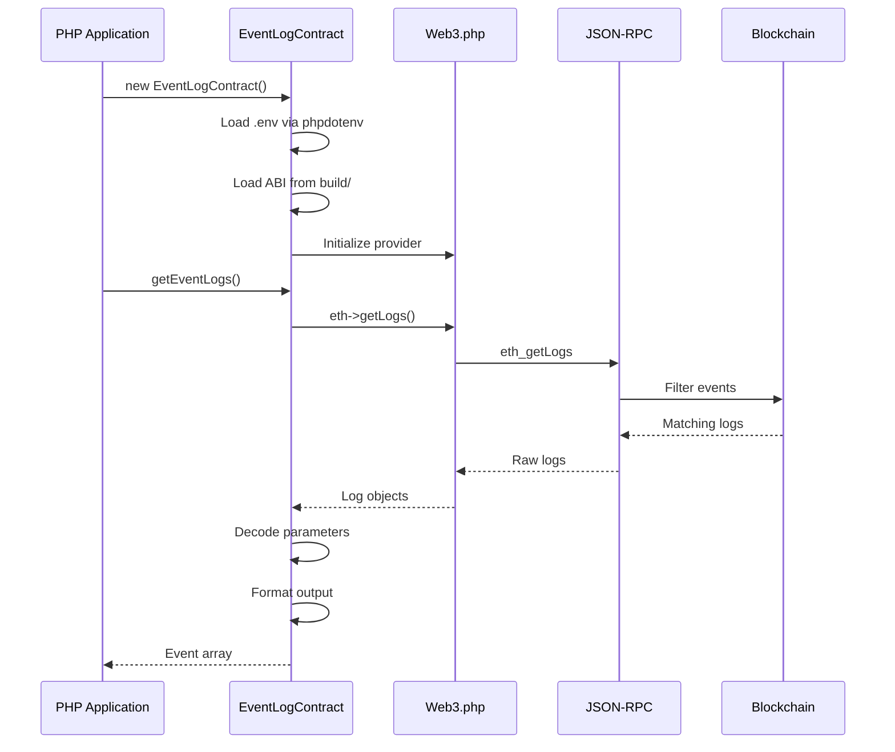
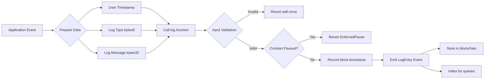
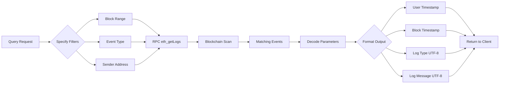
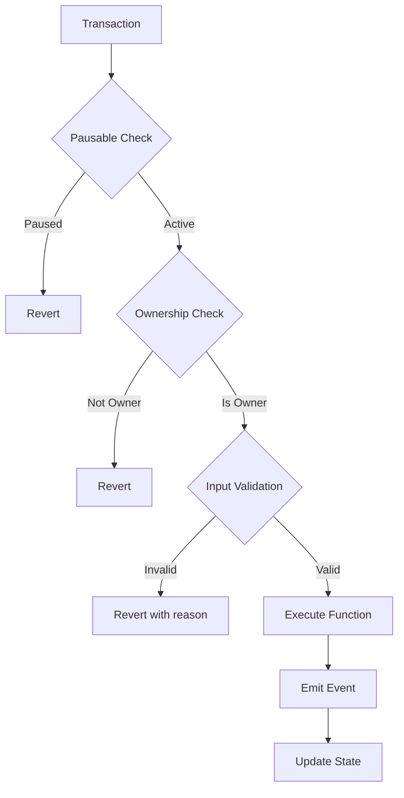

# EventLogChain Architecture

## System Overview



## Component Architecture

### Smart Contracts Layer

#### EventLog Contract



**Key Features:**
- **Dual Timestamp System**: Records both user timestamp (application time) and block.timestamp (blockchain time)
- **Access Control**: Owner-only pause/unpause and ownership transfer
- **Input Validation**: Validates all parameters before logging
- **Event Emission**: Emits LogEntry events for off-chain indexing

#### LogChainToken Contract



**Key Features:**
- **ERC20 Standard**: Full compliance with ERC20 token standard
- **Mintable**: Owner can mint new tokens
- **Burnable**: Token holders can burn their tokens
- **Initial Supply**: 1 trillion tokens with 2 decimals

### Client Layer

#### JavaScript Client Architecture



#### PHP Client Architecture



## Data Flow

### Logging Flow



### Event Retrieval Flow



## Security Architecture

### Access Control Matrix

| Function | Public | Owner Only | Paused Check |
|----------|--------|------------|--------------|
| log() | ✓ | ✗ | ✓ |
| pause() | ✗ | ✓ | ✗ |
| unpause() | ✗ | ✓ | ✗ |
| transferOwnership() | ✗ | ✓ | ✗ |
| mint() | ✗ | ✓ | ✗ |
| burn() | ✓ | ✗ | ✗ |
| transfer() | ✓ | ✗ | ✗ |

### Security Layers



## Deployment Architecture

### Development Environment

```
Local Dev
├── Ganache (localhost:7545)
├── Truffle (compilation & testing)
├── Web3.js/PHP clients
└── MetaMask (wallet interaction)
```

### Test Networks

```
Testnet Deployment
├── Ropsten/Sepolia
├── Infura (RPC provider)
├── HD Wallet Provider
└── Etherscan (verification)
```

### Production

```
Mainnet
├── Infura/Alchemy (RPC)
├── Multi-sig wallet (ownership)
├── Monitoring & alerts
└── Backup RPC providers
```

## Technology Stack

### Smart Contracts
- **Solidity**: ^0.8.20
- **OpenZeppelin Contracts**: ^5.0.0
- **Truffle**: ^5.11.5

### JavaScript Client
- **Web3.js**: ^4.16.0
- **Node.js**: >=16.0.0
- **dotenv**: ^16.0.0

### PHP Client
- **web3p/web3.php**: ^1.0
- **PHP**: >=7.4
- **phpdotenv**: ^5.5

### Development Tools
- **Ganache**: Local blockchain
- **Chai**: Testing assertions
- **OpenZeppelin Test Helpers**: Testing utilities
- **Solhint**: Solidity linter
- **Prettier**: Code formatter

## Performance Characteristics

### Gas Consumption
- **EventLog deployment**: ~450,000 gas
- **LogChainToken deployment**: ~1,200,000 gas
- **log() call**: ~27,362 gas (with dual timestamps)
- **transfer() call**: ~51,000 gas (typical ERC20)

### Scalability
- **Log storage**: Optimized with events (off-chain indexing)
- **Batch operations**: Can batch multiple logs in single transaction
- **Token transfers**: Standard ERC20 scalability

## Extension Points

### Future Enhancements
1. **Log Categories**: Add categorization system
2. **Access Control Lists**: Whitelist/blacklist loggers
3. **Log Encryption**: Optional encrypted log messages
4. **Token Staking**: Stake tokens to log events
5. **Governance**: Token-based voting for contract upgrades
6. **Multi-chain**: Deploy on multiple EVM chains
7. **Layer 2**: Optimize for Polygon, Arbitrum, Optimism
